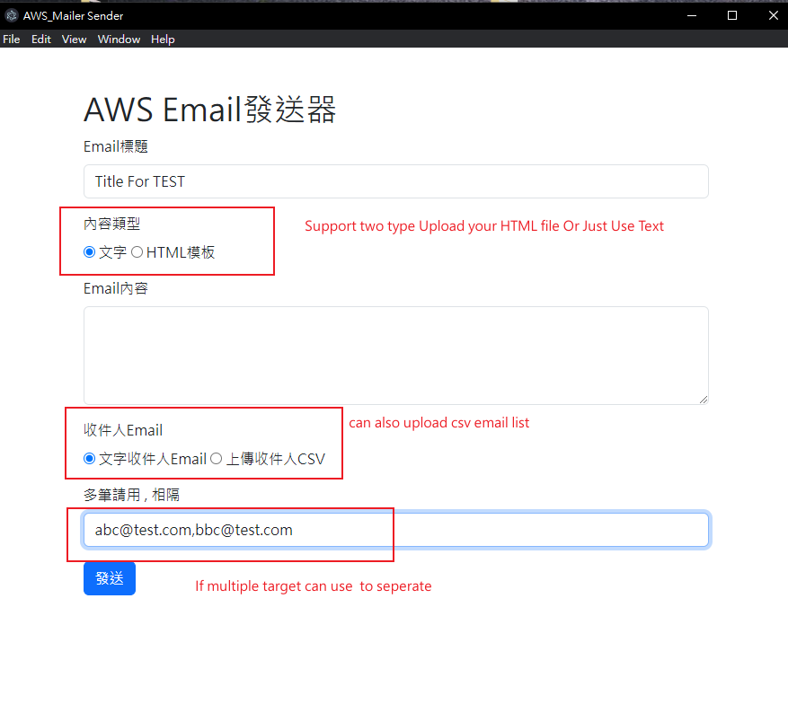

# How to use ?

## 1. Replace your AWS SES INFO to .env file

- AWS_ACCESS_KEY_ID=AWS_ACCESS_KEY_ID
- AWS_SECRET_ACCESS_KEY=AWS_SECRET_ACCESS_KEY
- AWS_REGION=AWS_REGION
- VERIFIED_EMAIL=VERIFIED_EMAIL

## 2. Install & Start the project

```
npm install
npm run start
```

## 3. Export to package APP

```
npm run package
```

## 4.csv format

| email        |
| ------------ |
| abc@test.com |
| bbc@test.com |

## Project Display


